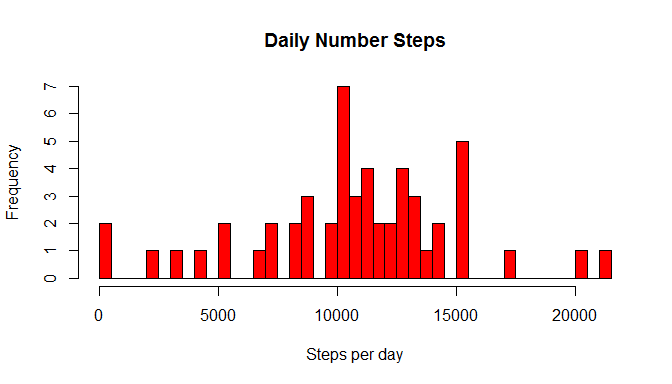
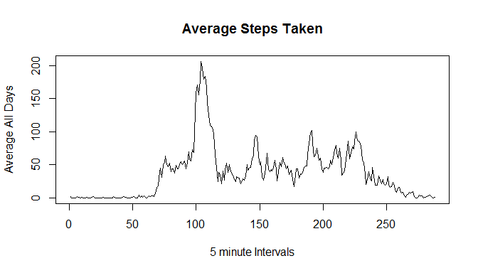
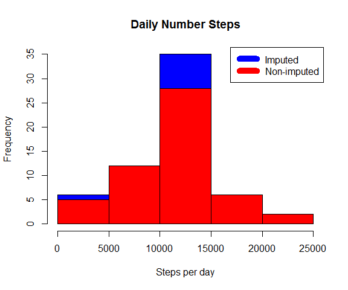
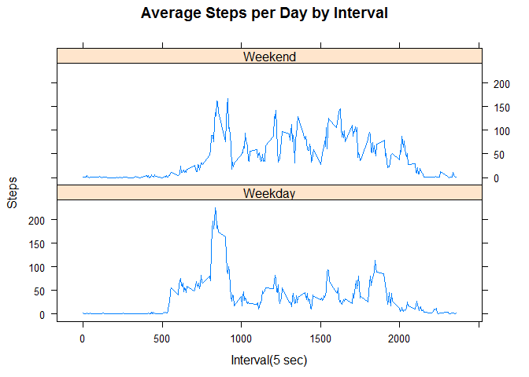

# Reproducible Research: Peer Assessment 1


## Loading and preprocessing the data
The data for this assignment was downloaded from the course web
site:

* Dataset: [Activity monitoring data](https://d396qusza40orc.cloudfront.net/repdata%2Fdata%2Factivity.zip) [52K]

Load data into data frame `data`. 


```r
data <- read.csv("activity/activity.csv")
data$steps <- as.numeric(data$steps)
data$interval <- as.numeric(data$interval)
```

The variables included in this dataset are:

* **steps**: Number of steps taking in a 5-minute interval (missing
    values are coded as `NA`)

* **date**: The date on which the measurement was taken in YYYY-MM-DD
    format

* **interval**: Identifier for the 5-minute interval in which
    measurement was taken

The dataset is stored in a comma-separated-value (CSV) file and there are a total of 17,568 observations in this dataset.


## What is mean total number of steps taken per day?
Ignoring the missing values in the dataset.
Sum steps by day, create Histogram, and calculate mean and median.


```r
stepsDate<-aggregate(steps ~ date, data = data, sum,na.rm=TRUE)
hist(stepsDate$steps,
     breaks=60, 
     col="red",
     xlab="Steps per day",
     main="Daily Number Steps" )
```

 


The `mean` is 1.0766189\times 10^{4} and the `median` is 1.0765\times 10^{4}.


## What is the average daily activity pattern?
Next a time-series plot was made which shows the 5-minute interval average of number of steps taken and averaged across all days.


```r
data$date <- as.character(data$date)
stepsInterval <- tapply(data$steps, data$interval, mean, na.rm = TRUE)
library(lattice)
plot(stepsInterval,
     type = "l",
     xlab = "5 minute Intervals",
     ylab="Average All Days",
     main="Average Steps Taken")
```

 

The 5-minute interval, on average across all the days in the data set, containing the maximum number of steps is 835.

## Imputing missing values

The total number of missing values in the dataset (i.e. the total number of rows with NAs) are 2304

Missing data needed to be imputed. Only a simple imputation approach was required for this assignment. 

Missing values were imputed by inserting the mean for each interval. Thus, if interval 15 was missing on 2012-10-01, the mean for that interval for all days (0.1509434), replaced the NA. 

```r
meanByInterval <- tapply(data$steps, data$interval, mean, na.rm = TRUE)
imputed <- data
imputed[is.na(data)] <- meanByInterval
imputed[as.character(imputed$date) == "2012-10-01",1] <- 0
```
Now, a new data frame is created `imputed`, which is contains the mean values for each interval.
Again, a histogram is created for the total number of steps taken each day which is compared graphically with the original dataset `data` for the total number of steps taken each day .

```r
CurrStepsDate<-aggregate(steps ~ date, data = imputed, sum,na.rm=TRUE)
hist(CurrStepsDate$steps,
      col="blue",
      xlab="Steps per day",
      main="Daily Number Steps")

stepsDate<-aggregate(steps ~ date, data = data, sum,na.rm=TRUE)
hist(stepsDate$steps,
     col="red",
     xlab="Steps per day",
     main="Daily Number Steps",
     add=T)
legend("topright", c("Imputed", "Non-imputed"), col=c("blue", "red"), lwd=10)
```

 

Calculate new mean and median for imputed data. 


```r
mean2 <- mean(CurrStepsDate$steps)
median2 <- median(CurrStepsDate$steps)
```

Calculate difference between imputed and non-imputed data.


```r
mean_diff <- mean2-mean1
median_diff <- median2 - median1
```

Calculate total difference.


```r
total_diff <- sum(CurrStepsDate$steps) - sum(stepsDate$steps)
```
* The imputed data mean is 1.0589694\times 10^{4} and median is 1.0766189\times 10^{4}
* The difference between the non-imputed mean and imputed mean is -176.4948964 and for median is 1.1886792
* The total difference between number of steps between imputed and non-imputed data is7.5363321\times 10^{4}, which indicate that there were 7.5363321\times 10^{4} more steps in the imputed data.

## Are there differences in activity patterns between weekdays and weekends?
Next, using the real and imputed data, we determine a time-series for the number of steps taken on average on the weekend versus the weekday by this individual.

```r
weekdays <- c("Monday", "Tuesday", "Wednesday", "Thursday", "Friday")
imputed$dow <- as.factor(ifelse(is.element(weekdays(as.Date(imputed$date)),weekdays), "Weekday", "Weekend"))

stepsIntervalByDow <- aggregate(steps ~ interval + dow, imputed, mean)
library(lattice)
xyplot(stepsIntervalByDow$steps ~ stepsIntervalByDow$interval|stepsIntervalByDow$dow, 
       main="Average Steps per Day by Interval",
       xlab="Interval(5 sec)",
       ylab="Steps",
       layout=c(1,2),
       type="l")
```

 

